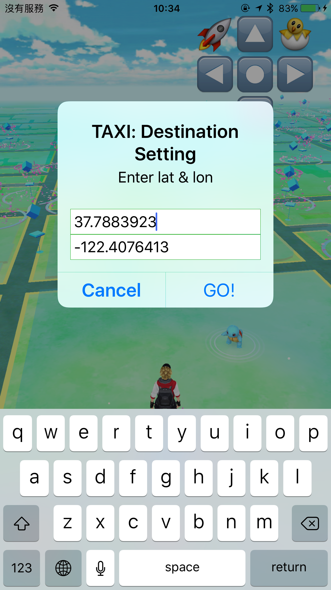

###How to install for Normal User: 一般使用者如何安裝
####English(英文說明)
0. Install Xcode from Apple Store. (at least 7.0)
1. Unzip "adr.sPokemonGo.app.zip" (from [my release page](https://github.com/aaaddress1/PokemonHook/releases)) and get the "pokemongo.app" that I built.
2. Sign "pokemongo.app" with your signature (Using [iResign](https://github.com/maciekish/iReSign), [iOS App Signer](https://dantheman827.github.io/ios-app-signer/), etc.) and you will get an ipa file.
3. Install your ipa file with iTune or Xcode.
4. Have fun!

####Chinese(中文說明)
0. 你需有一台蘋果系統 macOS 環境,從 Apple Store 安裝 Xcode (至少 7.0 以上版本) 軟體開發環境
1. 解壓縮我上傳的 "adr.sPokemonGo.app.zip" ([載點在此](https://github.com/aaaddress1/PokemonHook/releases)),解壓縮完後你會得到一個我製作好的 "pokemongo.app" 文件.
2. 使用你自己的簽章來替 "pokemongo.app" 做簽名 (常見的工具有這些: [iResign](https://github.com/maciekish/iReSign), [iOS App Signer](https://dantheman827.github.io/ios-app-signer/),...等) 簽名完後便可獲得一個 ipa 文件.
3. 透過 iTune 或者 Xcode 安裝 ipa 文件即可.
4. 安裝完畢後 iPhone 手機內便有外掛版本 PokemonGo 可以使用(記得要到設定內信任自己的簽章)

*******

###How to install for Jailbreak User: 越獄使用者如何安裝
####English(英文說明)
If you're a jailbreak user, you just need to install the PokemonGo Cracked ipa with iTune or XCode. You can find the ipa version PokemonGo in "adr.sPokemonGo.ipa.zip" at [my release page](https://github.com/aaaddress1/PokemonHook/releases).

**p.s. You need to install some tweak for bypassing signature checking or jailbreak cheaking, e.g.tsProtector, AppSync**

####Chinese(中文說明)
如果你的設備(iPhone,iPad)已經越獄, 你可以直接安裝我上傳的 ipa 版本外掛 PokemonGo. 至於 ipa 你可以透過解壓縮 ["adr.sPokemonGo.ipa.zip"](https://github.com/aaaddress1/PokemonHook/releases) 獲得.

**特別注意: PokemonGo ipa 破解版因為簽名是我的個人簽章, 你會需要使用一些越獄的 Tweak 來繞過簽章限制 (如 AppSync) 並且 PokemonGo 本身會校驗當前設備是否已越獄狀態, 因此你會需要安裝一些 Tweak 來反越獄檢測 (如 tsProtector, 最近好像也有人免費做了不少針對 PokemonGo 反越獄檢測的 Tweak)**

*******

###Feature: 功能
####English(英文說明)
1. You can move with direction button on screen without going outside.
2. Auto-Hatching Egg: The robot is able to hang out itself without your concern.
3. TAXI: The robot will walk back to destination you give.
4. Display current location.

####Chinese(中文說明)
1. 四個方向按鈕可直接待在家安全的前後左右操控人物, 不用害怕被來車碾到
2. 自動孵蛋模式: 機器人會自動操作人物在一個小範圍內自動游走孵蛋
3. 計程車模式: 輸入經緯度機器人便會行走到那個座標
4. 下方文字條顯示當前經緯度座標

*******

###How to fix "adr.sPokemonGo.app.zip" yourself: 如何自行添加修改功能

####English(英文說明)
0. Clone this project.
1. Fix my code yourself, build, and get a "libLocationFaker.dylib".
2. Replace the "libLocationFaker.dylib" in "adr.sPokemonGo.app" (from [my release page](https://github.com/aaaddress1/PokemonHook/releases)) with yours.
3. Sign "pokemongo.app" with your signature (Using [iResign](https://github.com/maciekish/iReSign), [iOS App Signer](https://dantheman827.github.io/ios-app-signer/), etc.) and you will get an ipa file.
4. Install your ipa file with iTune or XCode.
5. Have fun!

####Chinese(中文說明)
0. 下載這個專案
1. 用 Xcode 編輯這份專案用 Objective-C 修改完成後, 編譯生產出 libLocationFaker.dylib 文件
2. 替換掉 [adr.sPokemonGo.app](https://github.com/aaaddress1/PokemonHook/releases) 中的 libLocationFaker.dylib 換成你編譯好的 libLocationFaker.dylib
3. 處理簽章等問題 (或者已越獄) 即可安裝
